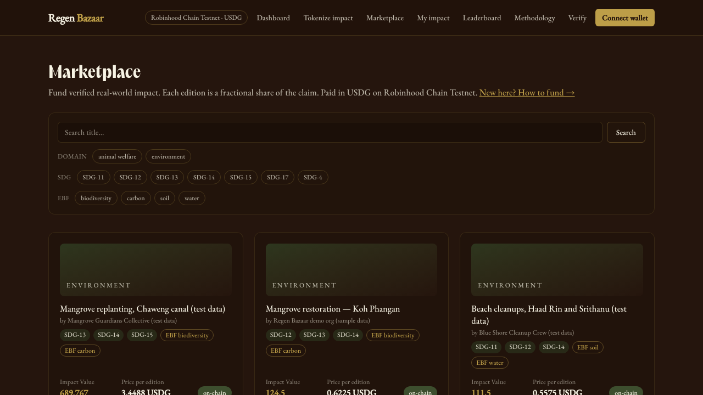

<p align="center"></p>
<h1 align="center">Regen Bazaar</h1>
<p align="center"><b>Fund verified real-world impact on-chain, paid in USDG, with provenance anyone can check.</b></p>
<p align="center">
  <a href="https://app.regenbazaar.com"><b>Try it</b></a> ·
  <a href="docs/ARCHITECTURE.md">How it works</a> ·
  <a href="packages/contracts/deployments">Contracts</a> ·
  <a href="https://app.regenbazaar.com/roadmap">Roadmap</a>
</p>
<p align="center"></p>

> Public beta on testnets. The same v3 contracts run on **Celo Sepolia** (where Regen Bazaar started),
> **Arbitrum Sepolia** and **Robinhood Chain testnet**, and the site's network switcher offers all three. Each impact
> report is listed on one network only, the one chosen when it was submitted.
> Impact Value weights are v0.1, platform-assessed, not third-party certified. No real funds.

Marketplace for **tokenized real-world impact (tRWI)**: NGOs across the full impact spectrum
(environment, animal welfare, education, poverty, social, health) report impact, a custom AI engine
scores it, a human verifies it, it's tokenized on-chain, then funded by buyers (people **and** AI
agents). Product backbone: **Work → Tokenize → Evaluate → Fund**. Reuse-first: battle-tested ReFi/OSS
primitives where possible; custom only where it's the moat: the AI Impact-Value engine.

- **Live:** https://app.regenbazaar.com serves three test networks; the visitor picks one (cookie). Contracts in
  `packages/contracts/deployments/{arbitrum-sepolia,robinhood-testnet,celo-sepolia}.json`, source-verified on
  Blockscout. Celo Sepolia, the original network, is paid in native CELO.
- **One report, one network:** a report is attested and listed only on the network selected when it was
  submitted, so the same impact is never sold on two chains.
- **Payment:** Paxos USDG on Robinhood Chain testnet. On Arbitrum Sepolia, Paxos USDG is allowlisted but the
  demo sells in `tUSDG`, a labelled testnet stand-in with the same interface, because the Paxos testnet faucet
  is not dispensing there.
- **Flow:** tokenize → verify → EAS-attest + IPFS → buyer redeems a platform-signed voucher (ERC-20 approve +
  redeem) → lazy mint → indexed (Ponder). Audience: non-crypto users (embedded wallets, gasless: later phase).

## Layout
```
apps/
  web/        Next.js 15 app: tokenize, verify, dashboard, marketplace, leaderboard, methodology,
              + APIs (/api/submissions, /api/verifications, public /api/impact for AI agents).
  indexer/    Ponder on-chain event indexer → Postgres. Scaffold/template; activates after deploy.
packages/
  impact-engine/  ★ The moat. Deterministic, versioned Impact-Value scoring (no dependencies).
  pipeline/       submit → extract (DeepSeek LLM) → score → persist. Rule-based fallback.
  db/             Drizzle schema + migrations; PGlite (dev) / postgres-js (prod) + migration runner.
  contracts/      Foundry: $REBAZ (ERC20), tRWI (ERC1155 UUPS, fractional editions), staking,
                  EAS attester resolver, unified deploy script.
deploy/       Dockerfile + isolated compose + nginx + runbook for the VPS (code-ready).
docs/         ARCHITECTURE.md · DECISIONS.md · KNOWN_ISSUES.md.
```

## Architecture
- **Chain = source of truth** for ownership/sales/stakes (indexed into Postgres). **Postgres** = off-chain
  data (profiles, submissions, verification queue, AI outputs) + the on-chain read-cache.
- **AI Impact-Value engine** (custom): LLM extraction of NGO free text → deterministic, versioned,
  auditable scoring `IV = Σ(AW·SM·TBV·ESM·PIM·ACDM)`. The LLM never scores; a human confirms before mint.
  Methodology is published in-app at `/methodology`.
- **tRWI** = ERC-1155 with fractional editions (Impact Value split across editions; retire to claim offset),
  EAS-attestation-gated mint, ERC-2981 royalties.
- **Onboarding** (later): ERC-4337 smart accounts + gasless paymaster (EntryPoint v0.6/0.7/0.8 live on Celo Sepolia).
- **Storage** (later): Cloudflare R2 + CDN primary, self-hosted IPFS (kubo) backup.

## Deployed (v3, testnets)
Source-verified on Blockscout. Full records, including proof transactions:
`packages/contracts/deployments/*.json`. Design: `docs/SMART_CONTRACT_DESIGN.md`.

**Arbitrum Sepolia (421614) and Robinhood Chain testnet (46630):** same deployer and nonce sequence, so the
addresses are identical on both chains.

| Contract | Address |
|---|---|
| RegenPrimarySale (voucher lazy-mint, stablecoin payments) | `0x79E4bEAF41F415cE3DF55DaDe3F86423e5399030` |
| TRWI (ERC-1155, UUPS proxy) | `0x6F2C6F81DDd35199d2e015710c61CC6D8B5de9da` |
| RegenMarketplace (secondary escrow) | `0x3Cd225C24183a7bcE3EefD3C309b82A27f6Be214` |
| TRWIStaking | `0xB051e3B360A54e6E4808A2A06bEC765D246612B6` |
| REBAZ | `0x5Ea6AE9758472733144Eb24CCE7f310B21367b92` |
| EAS / SchemaRegistry / Resolver | `0x95cD…d95d` / `0xa5dB…40b4` / `0xA4B1…abB1` |
| Paxos USDG (payment) | Arbitrum Sepolia `0xFFC9…1892` · Robinhood `0x7E95…802F` |

Example purchase in Paxos USDG on Robinhood Chain testnet (97.5% to the NGO in the same transaction):
[`0xea4a18d2…`](https://explorer.testnet.chain.robinhood.com/tx/0xea4a18d20c2fc3c4ed2a46ef7681129a99b905118745ff2de9ad95609ca2ba77)

**Celo Sepolia (11142220), the original network:** same v3 contracts at different addresses (`deployments/celo-sepolia.json`), with
purchases made through the app in June 2026, e.g.
[`0xce901fd1…`](https://celo-sepolia.blockscout.com/tx/0xce901fd12fceb8f166ddd585f96b5baa1c91e64864608b1c0d5f869bd79b1273),
and back in the site's network switcher since September 2026, e.g.
[`0xaf444006…`](https://celo-sepolia.blockscout.com/tx/0xaf444006452c3b3c3ff8d5981819b7516d54b8024cf7b2b1e87584266d10d28a).

Flow (proven live): approve → EAS-attest + IPFS + register listing (no mint) → buyer redeems a platform-signed
voucher → lazy mint + fee/NGO split → indexer. Secondary via the escrow marketplace.

## History
Built on Celo first: 2025 litepaper and demo MVP, contract prototypes on Stellar, Starknet and Move, Gitcoin GG23,
Celo Proof of Ship Season 4 (contracts on Alfajores, Next.js frontend). Rebuilt from scratch in June 2026 on Celo
Sepolia (v1 → v2 → hardened v3), then extended to Arbitrum Sepolia and Robinhood Chain testnet in September 2026.
Timeline with links: [github.com/Regen-Bazaar](https://github.com/Regen-Bazaar).

## Toolchain
pnpm workspaces · Next.js 15 / React 19 / Tailwind 4 · Foundry (Solidity 0.8.29) · Drizzle · PGlite · Ponder.
Local development needs **no Docker** (in-process PGlite + Foundry + Node/tsx).

## Run
```bash
pnpm install
pnpm web:dev            # http://localhost:3000 — in-process PGlite, auto-seeded demo data
```

## Test
```bash
bash packages/contracts/scripts/install-deps.sh   # one-time: fetch pinned Foundry deps into lib/
pnpm contracts:test                        # Foundry: 61 tests
pnpm --filter @rb/impact-engine test       # 12
pnpm --filter @rb/db test                  # 1
pnpm --filter @rb/pipeline test            # 4
pnpm web:build                             # production build
```

## Configuration
Secrets live only in `.env` (never committed); see each package's `.env.example`.
- `DEEPSEEK_API_KEY` (web) — optional; without it, extraction uses the deterministic rule-based fallback.
- `DATABASE_URL` (web) — set to use Postgres; omit locally for the in-process dev DB.

See `docs/ARCHITECTURE.md` for a plain-language overview and `docs/KNOWN_ISSUES.md` for current limitations.
